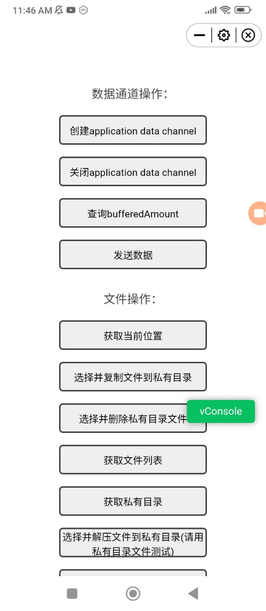

# 5G New Calling Terminal SDK - Progress Report

**Project:** IMS Data Channel SDK (China Telecom 5G Enhanced Calling)
**Date:** January 27, 2026
**Status:** Initial Testing Phase - Local Mode Only

---

## Executive Summary

Our team has successfully set up and tested the 5G New Calling Terminal SDK in local debugging mode. We have successfully built the SDK APK and deployed the demo mini-application. However, testing is currently limited to the local debugging variant as the dialer and normal modes require integration with a telecom operator's infrastructure and OEM terminal adaptation.

---

## 1. Project Understanding

### 1.1 Technology Overview

The **5G New Calling Terminal SDK** is an IMS Data Channel implementation developed by China Telecom Research Institute that enables:

- **Interactive data exchange during voice calls** using a dedicated IMS Data Channel
- **Real-time application integration** during active calls (AR, AI, file transfer, screen sharing, etc.)
- **Mini-app runtime environment** for web-based applications that can access call features

### 1.2 Architecture Components

The SDK architecture consists of:

- **InCallService Integration:** Manages lifecycle tied to call state
- **TS.71 IDL Interfaces:** AIDL interfaces between SDK and terminal for IMS DC operations
- **Extended Capability Interfaces:** OEM/operator-specific features via AAR packages
- **JS API Interfaces:** DSBridge-based communication between mini-apps and SDK
- **WebRTC DC Implementation:** GSMA TS.66 compliant data channel interfaces

### 1.3 Three Distribution Modes

| Mode | Entry Point | Requirements | Status |
|------|-------------|--------------|---------|
| **Local** | Home screen app | Local debugging only, no network | **Tested** |
| **Dialer** | Native dialer button | OEM adaptation + operator integration | **Not Testable** |
| **Normal** | Floating bubble during call | Operator integration | **Not Testable** |

---

## 2. What Has Been Accomplished

### 2.1 Build Environment Setup

- **Development Environment:** Android Studio with JDK 17, Gradle 8.1
- **SDK Version:** 1.1.1
- **Build Target:** compileSdk 34, minSdk 26
- **Architecture Support:** armeabi-v7a, arm64-v8a

**Successfully built all three APK variants:**
```
1. CtCallSDK_v1.1.1_20260126135721_local_release.apk (15.5 MB)
2. CtCallSDK_v1.1.1_20260126135721_dialer_release.apk
3. CtCallSDK_v1.1.1_20260126135721_normal_release.apk
```

### 2.2 Local Testing Environment

**APK Installation:**
- Installed: `app/build/outputs/apk/local/release/CtCallSDK_v1.1.1_20260126135721_local_release.apk`
- Application Name: "Telecom Enhanced Calling"
- Launch Method: From device home screen (no call required in local mode)

### 2.3 Demo Mini-Application Testing

**Tested Mini-App:**
- Source: `miniapp/demo/IMS_DC_Mini_app_demo_source_code/`
- Package: `miniapp/demo/IMS_DC_Mini_app_demo.zip`
- Technology: Vue.js 3 with Vite build system
- Configuration: `properties.json` with permissions and window styling

**Successfully installed mini-app:**



*Screenshot showing the demo mini-app running in local mode with all features displayed.*

#### Data Channel Operations:
- Create application data channel
- Close application data channel
- Query bufferedAmount
- Send data

#### File Operations:
- Get current location
- Copy files to private directory
- Delete files from private directory
- Get file list
- Get private folder path
- Decompress files

#### Mini-App Operations:
- Get mini-app info
- Set window mode (fullscreen/non-fullscreen)
- Answer/hangup calls
- Get call state
- Get remote number
- HTTP requests
- Launch third-party mini-apps
- Camera access (photo/video)
- Map integration (Gaode/Baidu)
- Browser opening
- Speakerphone control
- Mute control
- DTMF tone playback

#### Floating Window Operations:
- Display HTML in floating windows
- Remove floating windows

#### Contact Operations:
- Add contacts
- Edit contacts
- Get contact name
- Get contact list

#### Extended Capabilities:
- AI video detection
- Real-time translation (language list, start/stop, voice type)

---

## 3. Limitations and Challenges

### 3.1 Language Barrier

**Issue:** All UI elements and button labels are in Chinese
- Demo mini-app interface is entirely in Chinese
- Documentation exists in both English and Chinese versions
- API responses and error messages may be in Chinese

**Impact:**
- Requires Chinese language understanding for effective testing
- May need translation layer for English-speaking users
- Documentation reference is available in English (`5G New Calling IMS Data Channel JS API.docx`)

### 3.2 Testing Environment Constraints

**Cannot test Dialer and Normal modes because:**

1. **Operator Infrastructure Required:**
   - IMS network with Data Channel support
   - Telecom operator backend integration
   - Network negotiation for DC establishment during calls

2. **OEM Terminal Adaptation Required:**
   - Must implement TS.71 IDL interfaces in device firmware
   - Requires chipset support for IMS Data Channel
   - Need system-level integration (not possible on standard Android devices)
   - Reference: `document/5G New Calling SDK Terminal Adaptation Specification.docx`

3. **System App Integration:**
   - SDK must be installed as system default application
   - Requires device manufacturer cooperation
   - Cannot be installed via regular APK on consumer devices

### 3.3 Local Mode Limitations

**What Local Mode Provides:**
- Simulated call environment
- All JS API testing without real network
- File operations and UI testing
- Permission system testing

**What Local Mode Cannot Test:**
- Real IMS Data Channel creation/communication
- Network-based data transfer between devices
- Actual call integration
- Operator-specific extended capabilities
- Performance under real network conditions

---

## 4. Technical Analysis

### 4.1 Mini-App Development Stack

**Examined Source Code Structure:**
```
miniapp/demo/IMS_DC_Mini_app_demo_source_code/
 src/
    App.vue                 # Main application component
    pages/main.vue          # Feature demonstration page
    assets/                 # CSS and SVG resources
    components/             # UI components
 local_modules/
    webrtc/webrtcDC.js     # WebRTC DC implementation
 package.json                # npm dependencies
 vite.config.js             # Build configuration
 index.html                  # Entry point
```

**Key Technologies:**
- **Frontend:** Vue.js 3 with Composition API
- **Build Tool:** Vite
- **UI Framework:** Element Plus
- **Communication:** DSBridge for native bridge
- **Data Channel:** Custom WebRTC implementation (GSMA TS.66 compliant)

**Required Permissions** (from properties.json):
```json
[
  "MINIAPP_EXTERNAL_STORAGE",
  "MINIAPP_ACCESS_MINIAPPINFO",
  "MINIAPP_CAMERA",
  "MINIAPP_RECORD_AUDIO",
  "MINIAPP_READ_CONTACTS",
  "MINIAPP_GET_CALL_STATE",
  "MINIAPP_LOCATION"
]
```

### 4.2 Communication Architecture

**JS-to-Native Bridge (DSBridge):**
```javascript
// Synchronous call example
window.dsBridge.call("sync", `{"event":"MiniAppEvent","function":"getCallState","params":{}}`)

// Asynchronous call example
window.dsBridge.call("async", `{"event":"FileEvent","function":"getLocation","params":{}}`,
  function(response) {
    // Handle callback
  }
)
```

**Event Categories:**
- `MiniAppEvent` - Mini-app lifecycle and control
- `FileEvent` - File system operations
- `ScreenShareEvent` - Screen sharing features
- `ECEvent` - Extended capability requests

### 4.3 Data Channel Implementation

**WebRTC-based approach:**
- Uses RTCPeerConnection for establishing data channels
- XML-based configuration for DC parameters
- Supports ordered/unordered delivery
- Bandwidth and QoS configuration
- Binary data transfer capability

---

## 5. Documentation Review

### 5.1 Available Documentation

**English Documentation:**
1. `README.md` - Project overview and quick start
2. `5G New Calling IMS Data Channel JS API.docx` - Complete API reference
3. `5G New Calling SDK Terminal Adaptation Specification.docx` - OEM integration guide
4. `miniapp/demo/IMS_DC_Mini_app_demo_source_code/README.md` - Demo compilation guide

**Chinese Documentation:**
1. `5G New Calling IMS Data Channel JS API.docx` (Chinese version)
2. `5G New Calling SDK Terminal Adaptation Specification.docx` (Chinese version)
3. `miniapp/demo/IMS_DC_Mini_app_demo_source_code/README_CN.md`

### 5.2 Code Documentation Quality

**Observations:**
- Source code has good structural organization
- MVVM architecture with clear separation
- Kotlin-based implementation with coroutines
- Room database for persistence
- Jetpack Compose + XML hybrid UI

---

## 6. Next Steps and Recommendations

### 6.1 Immediate Actions (Can Do Now)

1. **Create English Mini-App Version**
   - Translate the demo mini-app UI to English
   - Create bilingual version with language switching
   - Document the translation layer approach

2. **Develop Custom Mini-Apps**
   - Study the demo source code structure
   - Follow the web development standards (HTML5, CSS3, ES6)
   - Package as ZIP with index.html and properties.json in root
   - Test in local debugging mode

3. **API Exploration**
   - Systematically test all JS API functions
   - Document behavior and responses
   - Create test suite for future regression testing
   - Map out which APIs work in local mode vs requiring network

4. **Enhanced Documentation**
   - Create developer onboarding guide
   - Document common pitfalls and solutions
   - Build example use cases beyond the demo

### 6.2 Medium-Term Goals (Requires Resources)

1. **Translation and Localization**
   - Translate error messages and system responses
   - Create English language pack if possible
   - Document Chinese-to-English term mappings

2. **Extended Testing Scenarios**
   - File transfer simulations
   - Screen sharing capabilities
   - Contact management workflows
   - Camera integration testing

3. **Custom Use Case Development**
   - Identify business-relevant mini-app scenarios
   - Develop proof-of-concept applications
   - Performance benchmarking in local mode

### 6.3 Long-Term Requirements (External Dependencies)

1. **Operator Partnership**
   - Partner with a telecom operator supporting IMS Data Channel
   - Obtain test accounts and network access
   - Get access to production or staging environment

2. **OEM Device Access**
   - Acquire adapted device from compatible manufacturer
   - Alternatively, partner with OEM for adaptation project
   - Requires device with chipset supporting IMS DC

3. **Full Integration Testing**
   - Test dialer mode with OEM-adapted device
   - Test normal mode with operator network
   - Performance testing under real network conditions
   - Multi-device interoperability testing

---

## 7. Risk Assessment

### 7.1 Technical Risks

| Risk | Probability | Impact | Mitigation |
|------|------------|--------|------------|
| Cannot obtain operator integration | High | Critical | Focus on local development, seek partnerships |
| OEM adaptation costs | High | High | Research white-label or development device options |
| Documentation gaps | Medium | Medium | Engage with China Telecom Research Institute |
| Dependency on Chinese ecosystem | High | Medium | Build abstraction layers, plan for alternatives |

### 7.2 Development Risks

| Risk | Probability | Impact | Mitigation |
|------|------------|--------|------------|
| Limited real-world testing | High | High | Maximize local mode testing, simulate scenarios |
| Language barriers | Medium | Medium | Use translation tools, maintain glossary |
| SDK updates breaking changes | Low | High | Version control, test thoroughly before upgrading |
| Limited community support | High | Medium | Build internal expertise, document findings |

---

## 8. Resource Requirements

### 8.1 For Continued Development

**Technical:**
- Android development environment (already set up)
- Web development skills (HTML5/CSS3/JavaScript/Vue.js)
- Understanding of WebRTC and IMS protocols
- Testing devices (standard Android phones for local mode)

**External (for full deployment):**
- Telecom operator partnership and network access
- OEM-adapted device (estimated cost: varies widely)
- Potential licensing or integration fees
- Access to China Telecom technical support

### 8.2 Time Estimates

**Mini-App Development (Local Mode):**
- Basic mini-app: 1-2 weeks
- Complex mini-app: 1-2 months
- Full testing suite: 2-3 weeks

**Production Deployment (with operator/OEM):**
- Operator negotiations: 3-6 months
- OEM adaptation: 6-12 months
- Testing and certification: 2-3 months

---

## 9. Conclusion

### 9.1 Summary of Achievement

Our team has successfully:
- Built and deployed the IMS Data Channel SDK in local debugging mode
- Tested the comprehensive demo mini-application
- Gained understanding of the architecture and capabilities
- Identified the limitations and requirements for production deployment

### 9.2 Current Position

We are positioned to:
- Develop custom mini-applications for testing in local mode
- Build proof-of-concept applications
- Demonstrate the technology's potential
- Prepare for future operator/OEM integration

### 9.3 Key Limitation

**Critical blocker:** Full production testing requires both:
1. Telecom operator infrastructure with IMS Data Channel support
2. OEM-adapted device implementing the TS.71 IDL interfaces

Without these, we can only work in simulated local mode, which is sufficient for development but cannot demonstrate real-world network functionality.

### 9.4 Recommendation

**Proceed with mini-app development** using the local debugging environment while simultaneously:
- Exploring operator partnership opportunities
- Investigating OEM device acquisition options
- Building internal expertise and documentation
- Developing multiple proof-of-concept applications

This dual-track approach maximizes current capabilities while working toward full deployment readiness.

---

## Appendices

### Key File Locations
- **Local APK:** `app/build/outputs/apk/local/release/CtCallSDK_v1.1.1_20260126135721_local_release.apk`
- **Demo Source:** `miniapp/demo/IMS_DC_Mini_app_demo_source_code/`
- **Demo Package:** `miniapp/demo/IMS_DC_Mini_app_demo.zip`
- **Documentation:** `document/`

### Build Commands
```bash
# Build all variants
./gradlew assembleRelease

# Build local variant only
./gradlew assembleLocalRelease

# Clean build
./gradlew clean assembleRelease
```

### Mini-App Development Workflow
```bash
# In miniapp/demo/IMS_DC_Mini_app_demo_source_code/

# Install dependencies
npm install

# Build the mini-app
npm run build

# Package as ZIP
# Ensure index.html and properties.json are in root of ZIP
# Copy ZIP to device sdcard for testing
```

---
